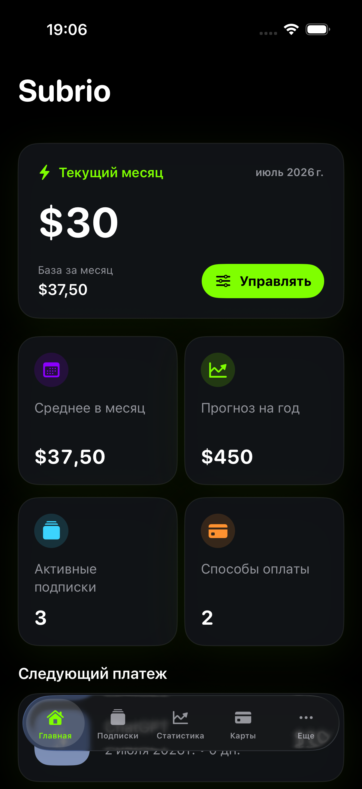
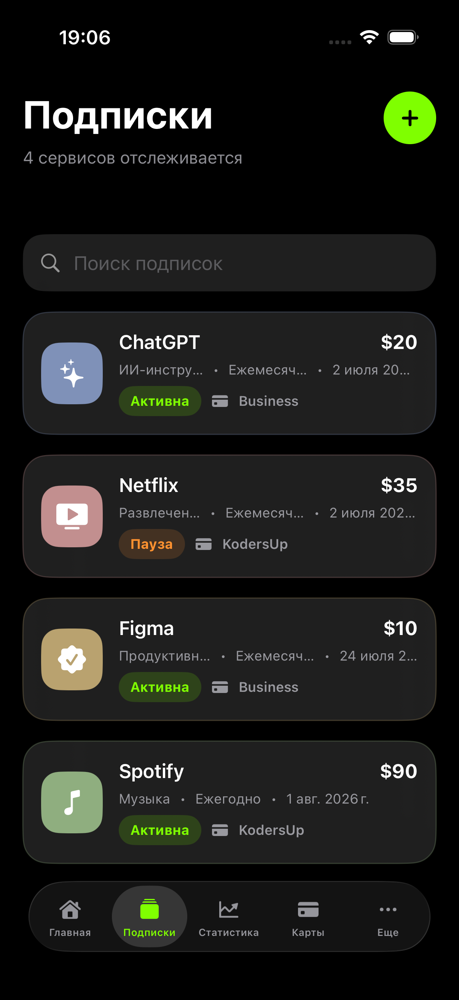
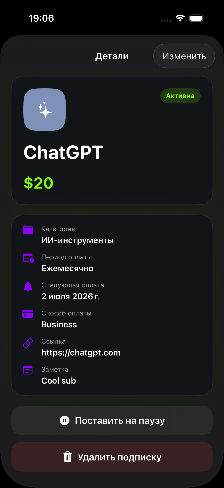
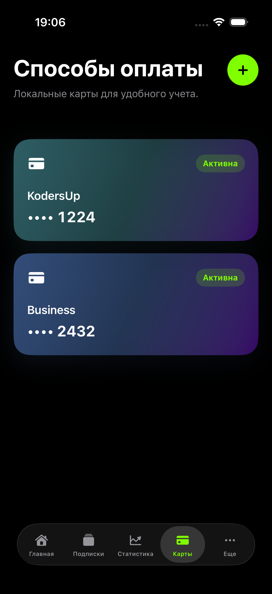
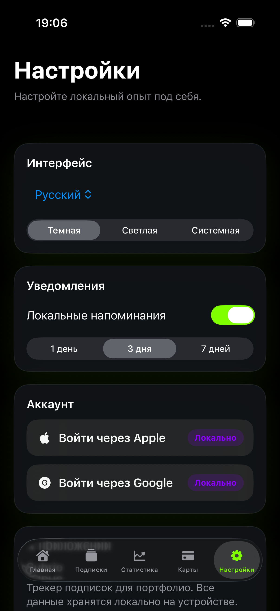

# Subrio

## 🇷🇺 Русская версия

Subrio - локальный iOS-трекер подписок, созданный на SwiftUI и SwiftData.

<p align="center">
  
  
  
  
  
  
</p>

## Возможности

- Отслеживание регулярных подписок, дат оплаты, периодов списания и статусов.
- Управление локальными способами оплаты для удобной организации подписок.
- Просмотр месячных расходов, годового прогноза, аналитики по категориям и ближайших платежей.
- Переключение интерфейса между русским и английским языками.
- Локальные уведомления с напоминаниями перед предстоящими платежами.

## Технологии

- SwiftUI
- SwiftData
- UserNotifications
- Структура Xcode-проекта с синхронизированными группами файловой системы

## Структура проекта

```text
Subrio/
  App/          Точка входа приложения и корневой экран
  Components/   Переиспользуемые UI-компоненты
  Models/       SwiftData-модели и перечисления
  Services/     Аналитика, haptics и уведомления
  Storage/      Вспомогательная логика для локального хранилища
  Theme/        Цвета приложения
  Utils/        Форматирование и локализация
  Views/        Экраны функций
```

## Запуск

1. Откройте `Subrio.xcodeproj` в Xcode.
2. Выберите схему `Subrio`.
3. Соберите и запустите приложение в iOS Simulator или на устройстве.

Приложение хранит данные локально на устройстве. Backend, API-ключи и учетные данные не требуются.

## Проверка

Проект проверялся командой:

```sh
xcodebuild -project Subrio.xcodeproj -scheme Subrio -destination 'platform=iOS Simulator,name=iPhone 17' build
```

## Сторонние лицензии

См. `ThirdPartyNotices.md`.

---

## 🇬🇧 English Version

Subrio is a local-first iOS subscription tracker built with SwiftUI and SwiftData.

<video src="demo.mp4" controls width="320">
  Your browser does not support embedded video. Open `demo.mp4` to watch the demo.
</video>

## Features

- Track recurring subscriptions, payment dates, billing periods and statuses.
- Manage local payment methods for organizing subscriptions.
- View monthly spend, yearly forecast, category analytics and upcoming payments.
- Switch between English and Russian interface text.
- Use local notification reminders before upcoming payments.

## Tech Stack

- SwiftUI
- SwiftData
- UserNotifications
- Xcode project structure with file-system synchronized groups

## Project Structure

```text
Subrio/
  App/          App entry point and root view
  Components/   Reusable UI components
  Models/       SwiftData models and enums
  Services/     Analytics, haptics and notifications
  Storage/      Local storage maintenance helpers
  Theme/        App colors
  Utils/        Formatting and localization helpers
  Views/        Feature screens
```

## Getting Started

1. Open `Subrio.xcodeproj` in Xcode.
2. Select the `Subrio` scheme.
3. Build and run on an iOS simulator or device.

The app stores data locally on device. It does not require backend credentials or API keys.

## Verification

The project was checked with:

```sh
xcodebuild -project Subrio.xcodeproj -scheme Subrio -destination 'platform=iOS Simulator,name=iPhone 17' build
```

## Third-Party Notices

See `ThirdPartyNotices.md`.
